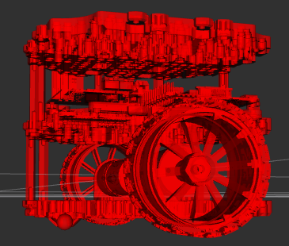
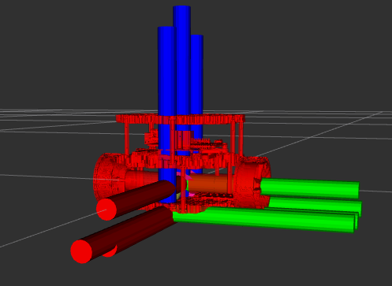

# BumperBot Xacro Description

This repository contains a simple URDF description of a bumperbot using a `.xacro` file. I put this together as part of my learnings from a ROS 2 tutorial. The file defines the robot’s structure with links, joints, and meshes for visual representation.

## Overview

The xacro file describes the bumperbot with the following key components:

- **Base:**  
  - `base_footprint` is defined as a reference link.
  - `base_link` is the main body of the robot. Its mesh is loaded from the `bumperbot_description` package.

- **Wheels:**  
  - `wheel_right_link` and `wheel_left_link` represent the robot's two wheels.
  - They are connected to the base with continuous joints, allowing rotation. Note the use of specific origins and orientations for each wheel.

- **Caster Wheels:**  
  - Two caster wheels are defined: `caster_front_link` and `caster_rear_link`.
  - They are attached via fixed joints to the `base_link`.

  

  
